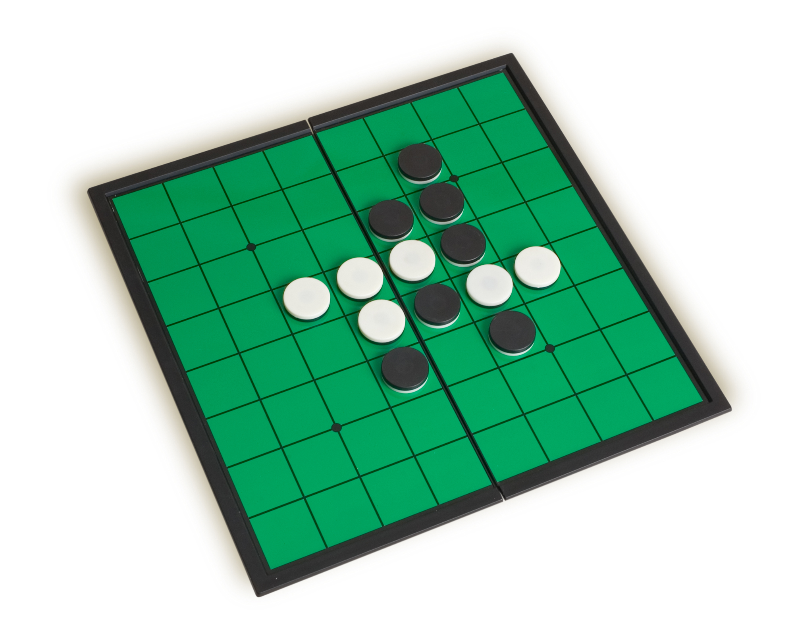

# Game of Othello

This repository contains the source code for a project I had done around 3 years ago. I am commiting this as a part of my efforts for some career moves like moving to a Tech Hub like Pune or Bangalore and working for a startup. So I have been brushing up data structures/algorithms for interviews and keeping my Github profile updated. And I hope so that this source code helps others who are new in their coding journey.

This projects implements the game of Othello, a popular board game also known as ConnectFour, Reversi or Columns. In the late 1980s, a puzzle-based game called Columns showed up on at least one personal computing platform. Later, it became somewhat more well-known when it was ported to the Sega Genesis, and later to other video game consoles and personal computers, becoming one of the better-known puzzle games of the early 1990s. In this project and the one that follows it, you'll be building a version of this game. It's not going to be our goal to completely duplicate the original, but what we'll be building will maintain its spirit throughout.

The basic objective of the game is to continue as long as possible, with the game ending as the field becomes to filled to continue. There are rules around scoring, of course — because a game like this is a lot less fun if there's no way to measure one's performance — but we'll skip them for the time being. For now, our goal is to implement the game's basic mechanics of fallers, movement and rotation, freezing, and the matching and disappearance of adjacent sequences of jewels of the same color.

A detailed look at how the program should behave can be found on the Official UCI ICS 32 project webpages [here](https://www.ics.uci.edu/~thornton/ics32/ProjectGuide/Project2/) and [here.](https://www.ics.uci.edu/~thornton/ics32/ProjectGuide/Project4/)

